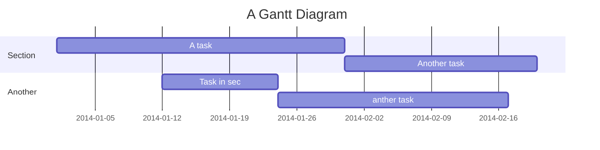

stock-ship-checker
===

## 動機
相信許多人平時課業或工作繁重，因此不想多花時間去看自己的股票APP，怕影響心情，做出不必要的買賣，所以做出了能查詢股價的line-bot，例如可能半個月看一次這個月的股價變化就好，並且最近進入大航海時代，因此也提供了FBX的航運報價，以提供使用者了解航運景氣的變動。
## 作品介紹
在Line-bot上輸入上市股價代號，並回傳此月的股價，以及繪製近兩個月的K棒給使用者(上櫃股目前還不行)，並且能查詢美洲航線很重要的FBX航運報價，並繪製當月的價格折線圖給用戶。

## 環境
### env
- Ubuntu 20.04.2 LTS
### python package

- 套件都放在requirement.txt，可用以下指令下載
```
pip install -r requirements.txt
```

## 使用的API介紹

* 台灣證券交易所:
    https://www.twse.com.tw/exchangeReport/STOCK_DAY_AVG?response=json&stockNo= ，stockNo=>上市股票代號

* 台灣證券交易所:https://www.twse.com.tw/exchangeReport/STOCK_DAY?response=json&date=&stockNo= ，date=日期(ex:20210501)，stockNo=>上市股票代號

* FBX:https://fbx.freightos.com/api/lane/FBX?isDaily=true
，isDaily=true=>回傳每日航運價格，isDaily=false=>一周航運價格
* Flask架設API:[https://ar3s.dev/stock/getpic?file=](https://ar3s.dev/stock/getpic?file=) ，file=candle.png or fbx.png
* Line message API

## stock.py功能講解
1. flask架設
2. line-bot連接
3. 利用Line-bot API回傳股價，以及航運報價
4. 如何傳照片講解
---
### Flask架設
建立Flask物件，並且設定靜態資料夾，用來存放line-bot要回傳的圖片，而所選擇的資料是linux環境內建的tmp，結構如下

```
app = Flask(__name__, static_folder='/tmp/')
```


建立測試路由，以供測試
```
@app.route("/")
def test():
    return "Hello"
```
開啟flask路由，port開在7777
```
if __name__=="__main__":
    app.run(port=7777)
```

### line-bot連接
關於如何建立line-bot及圖文選單請參考我寫的這篇文章:
[Google](https://www.google.com.tw)


```
#請填入自己的line-bot Chennel access token以及Channel secret 
line_bot_api = LineBotApi('聊天機器人的 Chennel access token')

handler = WebhookHandler('聊天機器人的 Channel secret')  
```   


建立callback路由，
檢查 LINE Bot的資料是否正確，藉由此路由與將line-bot與flask server做連接
```
@app.route("/callback",methods=['POST'])
def callback():
    signature = request.headers['X-Line-Signature']
    body=request.get_data(as_text=True)
    try:
        handler.handle(body,signature)
    except InvalidSignatureError:
        abort(400)
    return 'OK'
```


當使用者傳送訊息給LINE Bot時，會觸發MessageEvent事件，此處僅處理收到的文字訊息，「message = TextMessage」表示收到的是文字訊息，也就是說收到的是文字訊息才會由此路由處理，參數event包含傳回的各項訊息，例如建立的函式名稱為handle_message
```
@handler.add(MessageEvent,message=TextMessage)
def handle_message(event):
    ...
```

### 利用Message API回傳股價和航運報價


User flows
---
```sequence
使用者->linebot: Hello linebot, how are you?
Note right of linebot: line-bot thinks
linebot-->使用者: I am good thanks!
Note left of 使用者: 使用者 responds
使用者->linebot: Where have you been?
```

> Read more about sequence-diagrams here: http://bramp.github.io/js-sequence-diagrams/

Project Timeline
---


> Read more about mermaid here: http://mermaid-js.github.io/mermaid/

## Appendix and FAQ

:::info
**Find this document incomplete?** Leave a comment!
:::

###### tags: `Templates` `Documentation`
